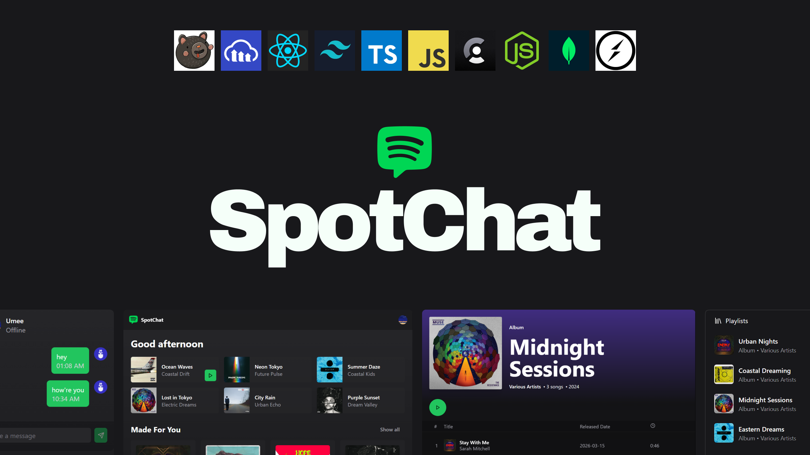
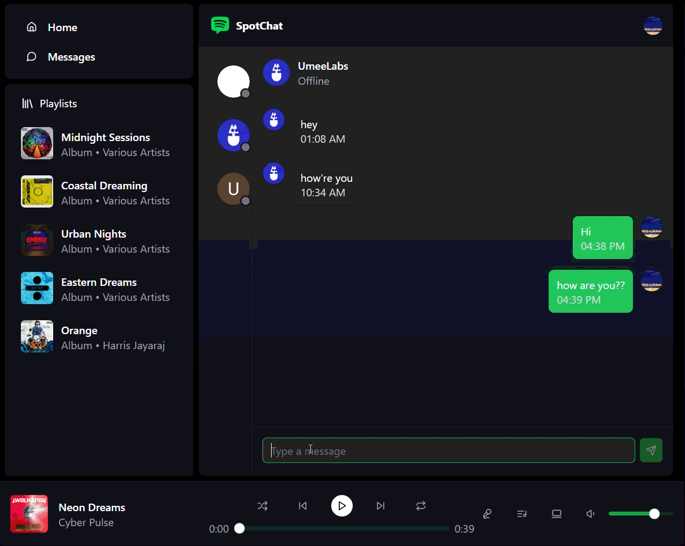
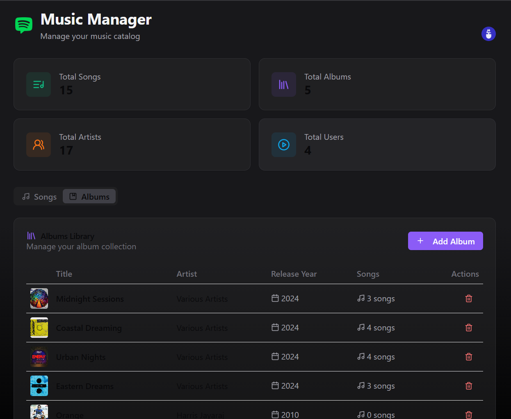

<h1 align="center">SpotChat — Real-time Music & Chat</h1>

<p align="center">
  
</p>

<p align="center">
  <a href="#"></a>
  <a href="#"></a>
  <a href="#"></a>
  <a href="#"></a>
  <a href="#"></a>
</p>

---

## The Idea

I've always thought Spotify is missing something. The music is there, the playlists are there, but the people aren't. You can see what friends are listening to buried three taps deep, but you can't talk to them about it. You can't share the moment.

SpotChat is what happens when you build music and chat as one thing from the start, not two separate features bolted together. Real-time presence, live activity tracking, and a full messaging layer, all inside a music player that actually feels good to use.

---

## What's Inside

- 🎸 Full music player — play, pause, next, previous, volume control
- 🔈 Persistent playback bar that stays across navigation
- 🎧 Admin dashboard to upload songs and albums via Cloudinary
- 💬 Real-time chat between users powered by Socket.io
- 👨🏼‍💼 Online and offline status per user, updated live
- 👀 See exactly what each friend is listening to in real time
- 📊 Analytics dashboard with aggregate stats across songs, albums, and users
- 🔐 Role-based auth — admin routes protected via Clerk middleware
- 🚀 Production-grade architecture with domain-separated state stores

---

## Player


Playback controls, volume slider, progress bar, and persistent bottom bar. Songs and albums stored on Cloudinary, served via a protected Express API. The admin dashboard lets you upload audio and cover art directly from the browser.

---

## Real-time Friends Activity


Every song change emits a socket event. Every connected client receives it instantly. When you switch tracks, your friends see it update in real time on their screen. When you close the tab, your status goes offline. No polling, no page refresh, just Socket.io doing what it's built for.

---

## Integrated Chat



Real-time messaging that feels instant because it is. Messages persist in MongoDB so history loads on reconnect. Socket.io delivers to online users the moment you send. The chat lives alongside the music, not away from it.

---

## Admin Dashboard



A protected route that only your email can access. Upload songs with audio files and cover images, create albums, delete content, and see platform-wide stats. Every admin API route runs through a Clerk-verified middleware chain before touching the database.

---

## Tech Stack

| Layer | Tools |
|---|---|
| Frontend | React, TypeScript, Tailwind CSS, Zustand, Axios, React Router |
| Backend | Node.js, Express, MongoDB, Mongoose |
| Realtime | Socket.io |
| Auth | Clerk |
| Storage | Cloudinary |
| State | Zustand — domain stores per feature |

---

## Architecture

Single monorepo with `frontend` and `backend` folders. The backend mounts an Express HTTP server and a Socket.io server on the same port via `http.createServer`. Clerk middleware runs on every request. Admin routes add a second middleware layer that fetches the user from Clerk and compares against `ADMIN_EMAIL`.

Frontend state is split into four Zustand stores: `useMusicStore`, `usePlayerStore`, `useChatStore`, and `useAuthStore`. Each store owns its fetching logic and socket event subscriptions. UI components receive state via hooks and stay purely presentational.
```
frontend/src/
 ├── pages/
 ├── components/
 ├── stores/
 ├── providers/
 ├── lib/
 └── types/

backend/src/
 ├── routes/
 ├── controllers/
 ├── models/
 ├── middleware/
 ├── lib/
 └── seeds/
```

---

## Setup

**Backend `.env`**
```bash
PORT=
MONGODB_URI=
ADMIN_EMAIL=
NODE_ENV=development
CLOUDINARY_API_KEY=
CLOUDINARY_API_SECRET=
CLOUDINARY_CLOUD_NAME=
CLERK_PUBLISHABLE_KEY=
CLERK_SECRET_KEY=
```

**Frontend `.env`**
```bash
VITE_CLERK_PUBLISHABLE_KEY=
```

**Run locally**
```bash
# Backend
cd backend && npm install && npm run dev

# Frontend
cd frontend && npm install && npm run dev

# Seed sample data
cd backend && npm run seed:albums
```

---

*Designed and built by Umesh*